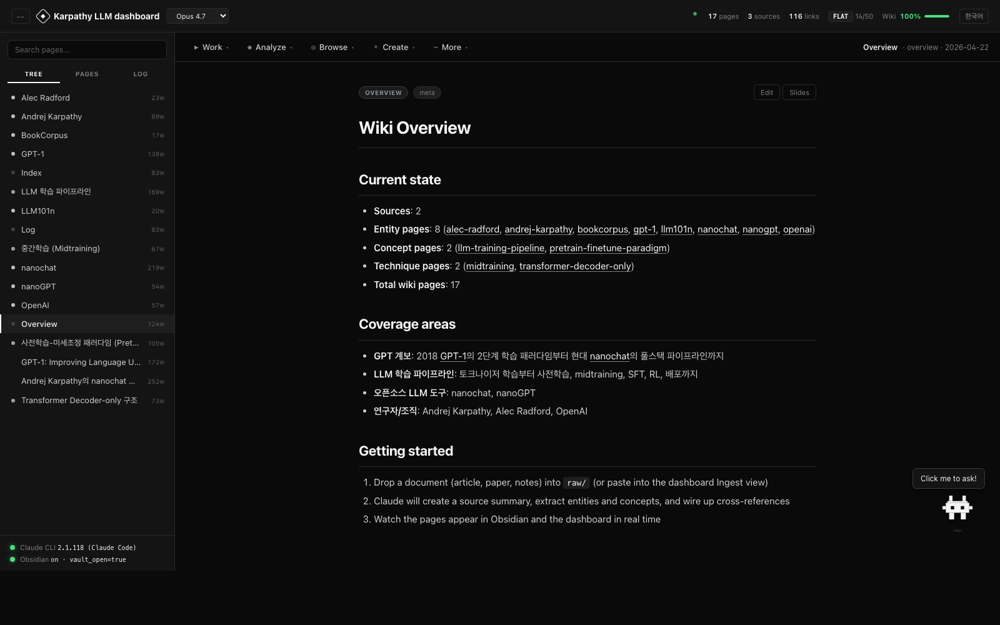
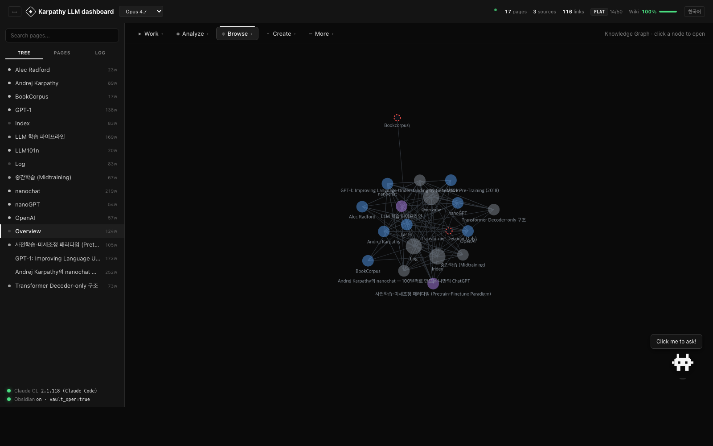
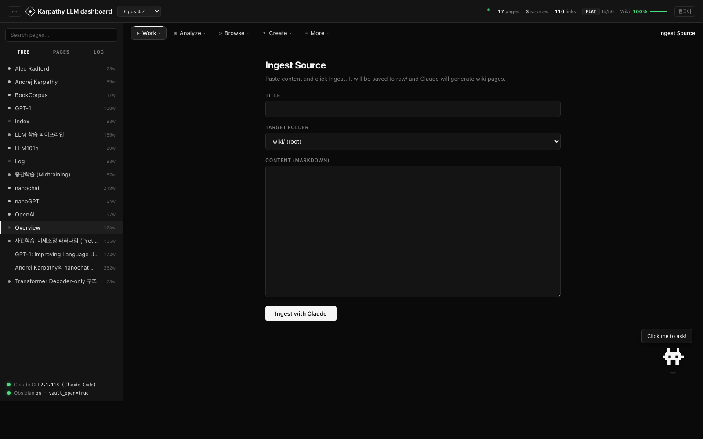
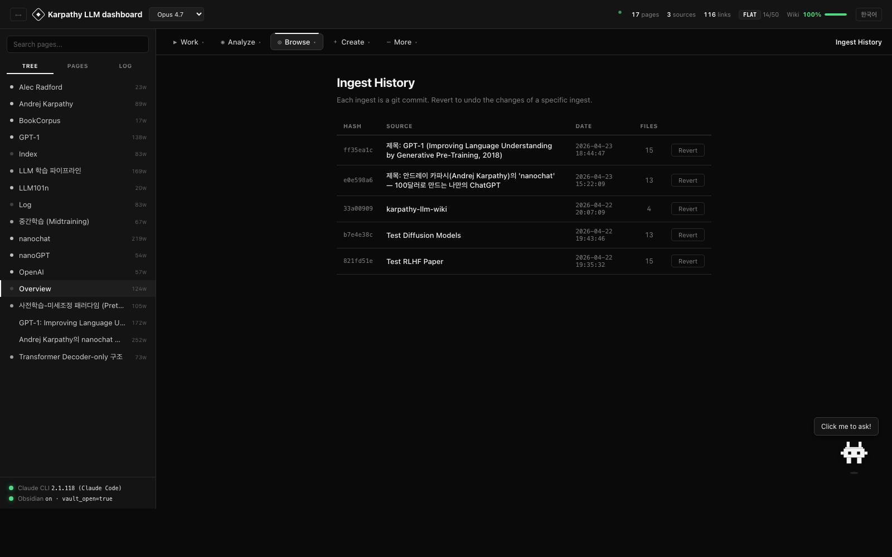

<div align="center">

<br />


<h1>Memex</h1>

<p><strong>一个能自己写自己的个人知识库。</strong></p>

<p>
丢进一份源文件。Claude 负责记账。<br/>
你的知识会不断复利。
</p>

<p>
<a href="#快速开始"></a>
&nbsp;

&nbsp;

&nbsp;

&nbsp;
<a href="README-ko.md"></a>
</p>

<br />

<p>
<em>"Obsidian 是 IDE。Claude 是程序员。Wiki 是代码库。"</em>
</p>

<br />


</div>

---

## 为什么？

大多数 LLM+文档 的方案在**每次查询时都要重新推导知识**。RAG 找到片段，模型拼接答案，什么都不保留。对同一批文档查询十次 → 十次重新发现。

**Memex 颠覆了这种做法。** 你添加一次源文件。Claude 读取它，将其整合到持久化的 wiki 中，标记与旧页面的矛盾，建立引用，然后提交结果。到第十次查询时，wiki 已经可以零成本地完成综合——记账工作早就完成了。

基于 [Andrej Karpathy 的 LLM Wiki 模式](https://gist.github.com/karpathy/442a6bf555914893e9891c11519de94f)。以 [Vannevar Bush 1945 年的 Memex](https://en.wikipedia.org/wiki/Memex) 命名。

---

## 模式

```
   projects/<slug>/    一个主题 = 一个项目。完全隔离。
     ├─ raw/           原始源文件。不可变。4 层保护。
     │    │
     │    ▼  ingest
     ├─ wiki/          Claude 维护的页面。实体、概念、摘要。
     │                 行内引用 [^src-*]。自动交叉引用。
     │                 每次变更都是一个 git 提交（前缀为 slug）。
     ├─ CLAUDE.md      每个项目的 schema（从模板初始化）
     └─ .settings.json 每个项目的模型（Opus / Sonnet / Haiku）
     ▼
   Obsidian 图谱 + 仪表盘
                       切换项目。浏览、查询、分析、反思、比较、写作。
```

- **你**：管理源文件、提问、引导分析、划定项目边界。
- **Claude**：摘要、交叉引用、引用、检测矛盾、归档。*限定于所选项目。*
- **Wiki**：在每个项目内部独立复利增长。

如果 `projects.json` 缺失或为空，服务器以兼容模式运行——将根目录的 `wiki/ raw/` 视为默认项目（现有配置保持不变）。

---

## 快速开始

```bash
git clone https://github.com/cmblir/memex.git
cd memex
python dashboard/server.py    # Python 3.10+，零 pip 依赖
```

打开 `http://localhost:8090`。完成。

<br />

<details>
<summary><strong>环境要求</strong></summary>

- Python 3.10+（仅标准库）
- [Claude Code CLI](https://docs.anthropic.com/en/docs/claude-code) — `npm install -g @anthropic-ai/claude-code`
- 一个浏览器
- Obsidian — *可选*，但已预配置。仓库自带就绪的 Obsidian 库。

</details>

---

## 将 Memex 连接到 Claude（MCP）

跳过仪表盘，让 Claude（Code、Desktop 或任何 MCP 客户端）作为 Model Context Protocol 服务器**直接**读取、搜索和维护 wiki。暴露了 14 个工具：`list_projects`、`list_pages`、`read_page`、`search`、`folder_tree`、`stats`、`recent_log`、`list_raw_sources`、`get_instructions`、`add_raw_source`、`create_page`、`update_page`、`create_folder`、`git_commit`。

### 一次性安装

```bash
bash mcp-server/install.sh   # 创建本地 venv 并安装 `mcp` SDK
```

脚本会打印两种客户端的确切注册命令和 JSON 片段。选择你用的那个。

### 从 Claude Code 使用

```bash
claude mcp add --scope user memex \
  -- "$PWD/mcp-server/.venv/bin/python" "$PWD/mcp-server/memex_mcp.py"
claude mcp list   # 验证
```

`memex` 现在会出现在每一个 Claude Code 会话中，即使在此仓库之外。

### 从 Claude Desktop 使用（不支持 claude.ai 网页版——仅 Desktop 应用）

打开 Claude Desktop 配置文件。**编辑前完全退出 Claude Desktop**（macOS 上按 Cmd+Q——否则 Dock 图标会保持存活）。

| 操作系统 | 路径 |
|---|--|
| macOS | `~/Library/Application Support/Claude/claude_desktop_config.json` |
| Windows | `%APPDATA%\Claude\claude_desktop_config.json` |

在 `mcpServers` 下添加 `memex`（将绝对路径替换为 `install.sh` 打印的内容）：

```json
{
  "mcpServers": {
    "memex": {
      "command": "/Users/<yourname>/Memex/mcp-server/.venv/bin/python",
      "args": ["/Users/<yourname>/Memex/mcp-server/memex_mcp.py"]
    }
  }
}
```

如果文件已有其他 MCP 服务器，只需在现有的 `mcpServers` 块内添加 `memex` 条目。重启 Claude Desktop。插件图标应列出 14 个 Memex 工具。

> **为什么不能用 claude.ai 网页版？** 网页版 Claude 仅支持通过 Connectors 连接远程 HTTP/SSE MCP 服务器——它无法访问本地的 stdio 进程。使用 Claude Desktop 来访问本地 Memex 库。

### 将聊天内容用作 wiki 源文件

`memex` 注册后，直接用自然语言向 Claude 提问。模型会根据你的话调用合适的工具。

**将当前对话保存为源文件**

> 把这次对话保存到我的 Memex wiki 中，标题为 "Transformer 缩放讨论"。

具体流程：Claude 编写一份对话的 markdown 摘要，调用 `add_raw_source` 将其写入 `raw/`（仅追加），创建或更新相关实体/概念页面并附上行内 `[^src-*]` 引用，追加 `wiki/log.md`，然后执行 `git_commit`。

**将一个一次性概念写入 wiki**

> 把我们刚讨论的 "缩放定律 vs 数据质量" 添加为分析页面。

Claude 调用 `search` 查找现有相关页面，用 `create_page(type=analysis)` 创建新页面，将其链接到最相关的实体页面，然后提交。

**每次会话固定 schema**

对于较长的会话，先让 Claude 加载规则，以确保遵守 frontmatter、引用格式和矛盾处理策略：

> 调用一次 `memex.get_instructions`，然后把整段对话当作 wiki 摄取会话——任何事实性内容都写入 wiki 并附引用，标记为 "草稿" 的内容仅保留在聊天中。

MCP 服务器复用与仪表盘相同的 `projects.json` 和 `wiki/` 目录——两个界面始终保持同步。`raw/` 保持不可变；`add_raw_source` 工具拒绝覆盖。详见 [`mcp-server/README.md`](mcp-server/README.md)。

---

## 你能得到什么

<table>
<tr>
<td width="50%" valign="top">

### ◆ 核心操作
- **Ingest（摄取）** — 粘贴源文件 → diff + WHY 报告 + 自动提交
- **Query（查询）** — 向 wiki 提问。追踪读取文件、Wiki 比率、Token
- **Lint（检查）** — 16 项健康检查 + 自动修复
- **Reflect（反思）** — 对整个 wiki 进行周度元分析
- **Write（写作）** — 从 wiki 起草文章，自动插入引用
- **Compare（比较）** — 两个页面 → 相似点/差异点
- **Review（回顾）** — 对过期页面进行间隔回顾
- **Search（搜索）** — TF-IDF 全文搜索，零依赖
- **Slides（幻灯片）** — 将任意页面导出为 Marp 演示文稿
- **Graph（图谱）** — 力导向知识图谱

</td>
<td width="50%" valign="top">

### ◆ 基础设施
- **多项目** — 一个仪表盘下管理隔离的 wiki、模型、模板
- **Git 支持的历史** — 每次摄取都是一次提交（`ingest(slug): ...`）
- **一键回滚** — 撤销任意一次摄取
- **行内引用** — `[^src-*]` 渲染为徽章
- **raw/ 不可变性** — 4 层保护，应用于每个项目的 `raw/`
- **自适应索引** — 扁平 → 层级 → 索引（自动）
- **Schema（CLAUDE.md）** — 根通用 + 每个项目独立
- **WHY 报告** — 每次摄取都解释自己的决策
- **查询日志** — 每个项目的 Wiki 比率仪表
- **双语 UI** — EN / 한국어 切换
- **模型选择器** — Opus / Sonnet / Haiku，按项目可选

</td>
</tr>
</table>

---

## 仪表盘

<div align="center">
<em>单色。分类。交互式。</em>
</div>

<br />

- **黑白配色** — 颜色仅用于状态和差异。
- **项目选择器** — 标题栏下拉切换活动项目（`Cmd/Ctrl + P` 聚焦）。`+` 创建新项目，`×` 软删除。
- **模型关联** — 模型下拉菜单与所选项目的模型同步。不同项目可以使用不同模型。
- **分类工具栏** — 5 个下拉菜单中包含 13 项操作（工作、分析、浏览、创建、更多）。
- **可调整大小的侧边栏** — 拖拽边缘调整，或 `Cmd/Ctrl + B` 折叠。
- **文件夹连续视图** — 点击文件夹*名称*可在一次滚动中阅读其所有页面。
- **实时状态** — Claude CLI + Obsidian 检测，仅原始事实。
- **Wiki 比率仪表** — 每个项目：Claude 引用 wiki 而非 raw 的频率。低于 0.4 意味着 wiki 还没有取代 raw。
- **浮动 Claude 角色** — 点击打开仪表盘内置聊天机器人，回答*关于仪表盘*的问题。Wiki 内容类问题会被重定向到 Query。

### 视图

<table>
<tr>
<td width="50%"></td>
<td width="50%"></td>
</tr>
<tr>
<td align="center"><sub><strong>概览</strong> — wiki 统计、覆盖区域、入门指南</sub></td>
<td align="center"><sub><strong>图谱</strong> — 力导向知识图谱</sub></td>
</tr>
<tr>
<td width="50%"></td>
<td width="50%"></td>
</tr>
<tr>
<td align="center"><sub><strong>摄取</strong> — 粘贴源文件，Claude 生成页面</sub></td>
<td align="center"><sub><strong>历史</strong> — Git 支持的摄取时间线，支持回滚</sub></td>
</tr>
<tr>
<td width="50%"></td>
<td width="50%"></td>
</tr>
<tr>
<td align="center"><sub><strong>溯源</strong> — 每个页面的引用覆盖</sub></td>
<td align="center"><sub><strong>查询</strong> — 向 wiki 提问，追踪读取文件</sub></td>
</tr>
</table>

<sub><em>想要你自己的截图？在服务器运行时运行 <code>docs/capture.sh</code>。</em></sub>

---

## 知识如何累积

以下所有内容都发生在 `projects/<slug>/` 内（或在兼容模式下发生在根目录）：

```
你放入一份源文件 ──────►  projects/<slug>/raw/article.md
                           │
                           ▼
   Claude 以项目根目录为 cwd 运行，加载其 CLAUDE.md：
   ├─ wiki/sources/source-article.md   （源文件摘要）
   ├─ wiki/entities/entity-X.md        （新建或更新）
   ├─ wiki/concepts/concept-Y.md       （新建或更新，附引用）
   ├─ wiki/index.md                    （已更新）
   ├─ wiki/log.md                      （已追加）
   └─ ingest-reports/...md             （WHY 报告）

                           │
                           ▼
   git commit "ingest(<slug>): <title>"
                           │
                           ▼
   仪表盘显示：diff + 推理 + 批准 / 回滚
```

每次摄取都可以回滚。每条论断都有引用。每个矛盾都有三种策略之一（历史 / 争议 / 已被取代）。每个项目完全隔离——项目 A 的摄取绝不能触及项目 B 的文件。

---

## CLI 使用

三个界面，一个 wiki——根据需要选择。

**1. 仪表盘** — 可视化图谱 + 表单驱动的摄取，访问 `http://localhost:8090`。

**2. 在此仓库中使用 Claude Code** — 仪表盘 shell 调用 `claude -p`，因此同样的提示词也可以在此终端中使用：

```bash
claude
"Ingest raw/some-article.md"
"What is Self-Attention?"
"Lint the wiki"
"Reflect on the last 10 ingests"
```

**3. 从任何地方使用 MCP** — 注册 `mcp-server/install.sh` 后，任何 Claude Code 会话（在此仓库内或外）和 Claude Desktop 都可以直接调用 14 个 Memex 工具。参见 [MCP 部分](#将-memex-连接到-claudemcp)。

三者共享 `projects.json` 和 `wiki/` 目录——变更在所有界面中立即可见。

---

## 配置

```bash
# 环境变量
CLAUDE_TIMEOUT=1200  python dashboard/server.py   # 大型摄取的 20 分钟超时
CLAUDE_QUICK_TIMEOUT=30
CLAUDE_TOOLS=Edit,Write,Read,Glob,Grep
```

**每个项目的设置**
- `projects/<slug>/.settings.json` — 当前项目的模型。可通过标题栏模型下拉菜单编辑。
- `projects/<slug>/CLAUDE.md` — 该项目的 Claude 规则。从模板复制初始化；可自由编辑。
- `projects.json` — 注册表 + 当前活动项目。

**根通用 schema**
- `CLAUDE.md`（根目录） — 跨项目的通用规则（真实性、git、模块化、性能）。每个项目的 `CLAUDE.md` 优先，但核心原则保持不变。

在此调整 frontmatter 规则、引用规则、矛盾解决、摄取工作流和检查清单——修改会在下次操作时生效。

---

## 故障排除

<details>
<summary><strong>"Claude CLI 超时"</strong></summary>

默认 10 分钟。使用 `CLAUDE_TIMEOUT=1800` 增加超时。仪表盘在超时时显示**运行 Claude CLI 诊断**按钮——它调用 `/api/claude/diagnose` 检查安装、认证、响应时间、模型速度。

</details>

<details>
<summary><strong>"库未注册"</strong></summary>

悬停在状态栏上——它会显示你的项目路径与 Obsidian 已知库的对比。点击**注册**以自动添加到 `obsidian.json`，然后重启 Obsidian。

</details>

<details>
<summary><strong>摄取速度慢</strong></summary>

Opus 4.7 最慢。在标题栏下拉中切换到 **Sonnet 4.6** 或 **Haiku 4.5** 以加快摄取速度。

</details>

<details>
<summary><strong>Expecting value: line 1 column 1</strong></summary>

这是 Python 的空 JSON 错误。已修复——现在所有端点即使在崩溃时也返回有效 JSON。如果仍然看到，检查 `/tmp/wiki-server.log` 获取回溯信息。

</details>

---

## 仓库布局

```
raw/                       （兼容）不可变源文件——迁移时移至项目下
wiki/                      （兼容）Claude 维护的页面
  index.md                 内容目录（自动 扁平/层级）
  log.md                   活动时间线
  overview.md              统计 + 覆盖区域
ingest-reports/            每次摄取一个 WHY 报告
reflect-reports/           周度元分析
projects/                  多项目根目录（见下文）
  <slug>/
    CLAUDE.md              项目 schema
    .settings.json         每个项目的模型等
    wiki/                  项目 wiki（sources/entities/concepts/...）
    raw/                   项目源文件
    ingest-reports/、reflect-reports/、plans/、query-log.jsonl
projects.json              项目注册表（活动 + 列表）
templates/                 项目模板（通用 + 变体）
plans/                     工作队列 / 积压 / 阻塞
logs/                      自主模式会话日志
dashboard/
  server.py                零依赖 API 服务器
  project_registry.py      项目解析器 + 注册表
  index.html               单文件仪表盘 UI
  provenance.py            引用解析 + 覆盖
  index_strategy.py        自适应索引
  claude_character.svg     浮动助手
CLAUDE.md                  根通用 schema
.obsidian/                 预配置的库
```

---

## 多项目

从单一仪表盘运行多个独立主题（项目）。每个项目有自己的 `wiki/ raw/ CLAUDE.md .settings.json`，可独立配置模型、模板和文件夹结构。

**在仪表盘中**

- 标题栏下拉切换活动项目（Cmd/Ctrl+P 聚焦）
- `+` 按钮打开新建项目模态框（标题 / slug / 描述 / 模板 / 模型）
- `×` 按钮将当前项目移至 `projects/.trash/`（软删除；保留文件）
- 切换会将后续所有操作（摄取 / 查询 / 检查 / 写作 / 比较 / ...）限定到该项目的 `raw/` 和 `wiki/`

**模板**

创建时选择模板会自动生成 `wiki/` 子文件夹：

| 模板 | 默认文件夹 |
|---|---|
| generic | `sources entities concepts techniques analyses` |
| llm-research | `sources models techniques concepts entities benchmarks analyses` |
| reading-log | `sources authors ideas quotes reviews` |
| personal-notes | `daily topics people projects` |

模板 `CLAUDE.md` 文件位于 `templates/<name>/CLAUDE.md`，会被复制（进行 `{{TOPIC}}` / `{{PURPOSE}}` 替换）到新项目中。

**API（也可从命令行使用）**

```bash
# 列出项目 + 活动项目
curl http://localhost:8090/api/projects

# 创建
curl -X POST http://localhost:8090/api/projects/create \
  -H 'Content-Type: application/json' \
  -d '{"slug":"ml-papers","title":"ML Papers","description":"papers",
       "model":"claude-sonnet-4-6","template":"llm-research"}'

# 切换
curl -X POST http://localhost:8090/api/projects/switch \
  -H 'Content-Type: application/json' -d '{"slug":"ml-papers"}'

# 限定范围的调用
curl "http://localhost:8090/api/wiki?project=ml-papers"
curl -X POST http://localhost:8090/api/ingest \
  -H 'Content-Type: application/json' \
  -d '{"project":"ml-papers","title":"...","content":"..."}'
```

**兼容模式**

如果 `projects.json` 缺失或为空，服务器以兼容模式运行——将根 `wiki/ raw/ CLAUDE.md` 视为默认项目。现有设置在创建第一个项目之前保持不变。

---

## API

仪表盘通过 35+ 个端点与服务器通信。大多数端点通过 `?project=<slug>` 查询字符串（GET）或 JSON body 中的 `"project"` 字段（POST）接受项目范围；省略则回退到活动项目。

<details>
<summary><strong>显示所有端点</strong></summary>

**项目管理**

| 方法 | 路径 | 描述 |
|--------|------|-------------|
| GET | `/api/projects` | 列出项目 + 活动项目 + 兼容信息 |
| GET | `/api/projects/active` | 当前活动项目 |
| GET | `/api/templates` | 可用模板 + 推荐文件夹 |
| POST | `/api/projects/create` | 新建项目（slug / title / description / model / template） |
| POST | `/api/projects/switch` | 切换活动项目 |
| POST | `/api/projects/update` | 更新项目模型 / 标题 / 描述 |
| POST | `/api/projects/delete` | 软删除 → `projects/.trash/` |

**数据 / 状态**

| 方法 | 路径 | 描述 |
|--------|------|-------------|
| GET | `/api/status` | Claude CLI + Obsidian — 仅原始事实 |
| GET | `/api/wiki` | 完整 wiki 数据（项目范围） |
| GET | `/api/folders` | 文件夹树（项目范围） |
| GET | `/api/hash` | 变更检测（项目范围） |
| GET | `/api/schema` | 读取 CLAUDE.md（项目范围） |
| GET | `/api/history` | 摄取提交 |
| GET | `/api/provenance` | 引用覆盖（项目范围） |
| GET | `/api/query-stats` | Wiki 比率（项目范围） |
| GET | `/api/index/status` | 策略徽章（项目范围） |
| GET | `/api/raw/integrity` | raw/ 篡改检查 |
| GET | `/api/reflect/status` | 上次反思日期（项目范围） |
| GET | `/api/review/list` | 过期页面（项目范围） |
| GET | `/api/settings` | 模型选项 + 每个项目当前模型 |
| GET | `/api/claude/diagnose` | CLI 快速检查 |

**操作（均为项目范围）**

| 方法 | 路径 | 描述 |
|--------|------|-------------|
| POST | `/api/ingest` | 新源文件 → wiki 页面 |
| POST | `/api/query` | 向 wiki 提问 |
| POST | `/api/query/save` | 将答案保存为页面 |
| POST | `/api/lint` / `/api/lint/fix` | 健康检查 |
| POST | `/api/reflect` | 元分析 |
| POST | `/api/write` | 写作助手 |
| POST | `/api/compare` | 两页分析 |
| POST | `/api/review/refresh` | 刷新过期页面 |
| POST | `/api/slides` | Marp 导出 |
| POST | `/api/search` | TF-IDF 搜索 |
| POST | `/api/suggest/sources` | 建议下一步摄取内容 |
| POST | `/api/provenance/fix` | 添加缺失引用 |
| POST | `/api/index/rebuild` | 强制重建索引 |
| POST | `/api/revert` | 回滚一次摄取（仓库级 git） |
| POST | `/api/page` / `/update` / `/delete` | 页面 CRUD |
| POST | `/api/folder` | 创建文件夹 |
| POST | `/api/schema` | 更新 CLAUDE.md |
| POST | `/api/settings` | 更改模型（兼容 → 全局；项目 → `.settings.json`） |
| POST | `/api/assistant` | 仪表盘助手聊天机器人（项目无关） |
| POST | `/api/obsidian/register` | 将此文件夹添加到 obsidian.json |

</details>

---

## 键盘快捷键

- `Cmd/Ctrl + P` — 聚焦项目选择器
- `Cmd/Ctrl + B` — 切换侧边栏
- `Esc` — 关闭下拉菜单 / 模态框

---

## 致谢

- **模式**：[Andrej Karpathy](https://github.com/karpathy) — *[LLM Wiki](https://gist.github.com/karpathy/442a6bf555914893e9891c11519de94f)*。
- **前身**：[Vannevar Bush, "As We May Think"](https://en.wikipedia.org/wiki/As_We_May_Think), 1945。
- **构建工具**：[Claude Code](https://docs.anthropic.com/en/docs/claude-code)。

---

<div align="center">
<br/>
<sub>MIT License · <a href="README-zh.md">中文 README</a></sub>
</div>
