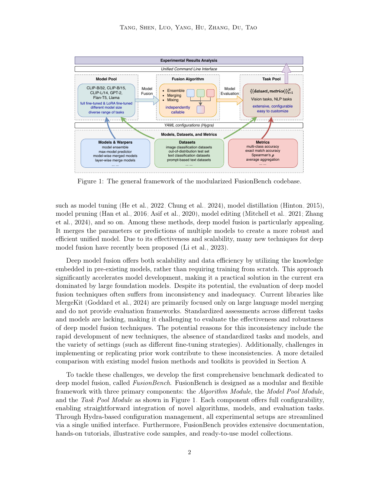

#+title:      八个专才，合成一个
#+subtitle:   多任务专才模型该怎么并——FusionBench: A Unified Library and Comprehensive Benchmark for Deep Model Fusion
#+date:       [2026-07-31 Fri 20:48]
#+filetags:   :paper:
#+identifier: 20260731T204831
#+source:     https://www.jmlr.org/papers/volume26/25-1243/25-1243.pdf
#+authors:    Anke Tang, Li Shen, Yong Luo, Enneng Yang, Han Hu, Lefei Zhang, Bo Du, Dacheng Tao
#+venue:      JMLR 26 (2025) 1-38

* 问题

你手里有八个 CLIP 视觉模型。一个专认街景（SUN397），一个专认车型（Cars），一个专认卫星地物（RESISC45），一个专认交通标志（GTSRB）……每个在自己的任务上准确率冲到 75%–99%，换个任务就塌。你想要一个模型同时干八件事。

旧路有两条。一条是传统多任务学习：把八份数据搅在一起重新训。能到约 88.6% 平均准确率，但要重新占 GPU、重跑数据、重调超参——基础模型时代这越来越贵。另一条是社区里一窝蜂冒出来的「模型融合」：把八个专才的权重直接在参数空间里加、减、剪、对齐，希望得到一个仍保持单模型体积的多面手。问题是：论文各用各的任务、各用各的微调方式、各用各的实现，MergeKit 一类工具又主要盯着大语言模型、还不带评测。你没法公平地说「AdaMerging 是不是真比 Ties-Merging 强」。

FusionBench 看到的入口是：缺的不是又一个融合算法，而是同一套模型池、同一套任务池、同一套可复现管线——让融合方法在同一把尺子上比。

* 翻译

#+ATTR_ORG: :width 1200

把那八个 CLIP 专才想象成八个只练过一门课的研究生。FusionBench 不教他们一起上课，而是定规矩：怎么把八份笔记合成一本共用笔记本，再拿同一张卷子考。

** 三块积木

整套东西拆成三块，互相可插拔：

- *算法模块*：每一种融合方法是一个独立类，继承同一基类，命令行或脚本都能调。
- *模型池*：管加载、保存、数据。换 CLIP、ResNet、GPT-2、Flan-T5，算法代码不用改。
- *任务池*：数据集加指标绑定。有任务池就评；没有就只融、只存。

配置走 Hydra 的 YAML。典型流水线就四步：选算法和模型 → 跑融合 → 可选存盘 → 可选评测出报告。

** 三类融合，外加压缩

作者把「深度模型融合」切成三刀，再挂一刀压缩当配套：

1. *集成*：八个模型都留下，预测时投票或加权。准，但推理要跑八遍，存八份。
2. *合并*：八份参数合成一份，推理只跑一个。Model Soup 平均、任务算术、Ties-Merging、Fisher、RegMean、AdaMerging 等都在这里。
3. *混合*：不只平均权重，还重组层、升成专家混合、做稀疏升尺度。模型往往变大、更表达，但常要再训或测试时适配。
4. *压缩*：剪枝、BitDelta 等——严格说不是融合，但和「融完再压」是同一条工程链。

Table 1 把几十种方法按「要不要标数据 / 要不要测试时训练 / 要不要超参搜索」标了需求。这张表本身就是选型清单。

** 在八个 CLIP 任务上发生了什么

同一套八任务、CLIP-ViT-B/32：

| 路线 | 平均准确率（约） |
|------|------------------|
| 预训练原模 | 48.2% |
| 简单权重平均 | 66.5% |
| 任务算术 | 68.0% |
| Ties-Merging | 72.2% |
| Fisher | 70.6% |
| RegMean / RegMean++ | 82.4% / 84.4% |
| 层间 AdaMerging（测试时适配） | 82.6% |
| WEMoE / SMILE（混合，扩容） | 89.2% / 89.3% |
| 传统多任务重训 | 88.6% |
| 八个单任务专家各自最优（上界） | 90.3% |

大白话：乱平均能从 48 拉到 66；用数据对齐（RegMean）能冲到 82 以上；测试时按层学融合系数（AdaMerging）也在同一档；真正逼近「重新多任务训」的是混合路线（WEMoE/SMILE），但它们不是免费的——模型结构变了或要适配。层间适配明显强于任务级适配（82.6 对 68.7），说明「每一层该听谁的」比「全局一个系数」重要得多。

换更大的 ViT-L/14，单任务上界 94.3，SMILE/WEMoE 到 93.6–93.8，融合与专家的缝更窄——大模型参数空间更好并。

** 不止视觉

- *NYUv2 三任务 ResNet*：分割 / 深度 / 法向专家在别人的任务上几乎废掉；只并骨干、头分开，平均法就能让三件事都「还行」，虽然分割从 52 mIoU 掉到 39 一带。
- *GPT-2 乘 GLUE 七分类*：简单平均约 56，任务算术 / Ties 约 70，仍远低于单任务 82——语言侧缝更大。
- *Flan-T5 LoRA 八任务*：base 上 SMILE 平均 84.0，逼近单任务 84.6；large 上 Ties / 任务算术 / 层间 AdaMerging 到 87.3–87.6（单任务 89.6）。LoRA 先合回全参再融。

** 泛化与鲁棒的冷水

六任务并完去考两个从没见过的任务：见过的任务可以很高，没见过的常常只略好于预训练，有时还出现负迁移——并进去的知识对某个未见任务有害（例如某设定下 RESISC45 上融后反而不如预训练）。

加运动模糊、脉冲噪声、像素化等腐蚀：所有方法都掉；测试时适配的 AdaMerging / WEMoE 在中等腐蚀上更扛，但在极端腐蚀（像素化、某些噪声）上也会崩，甚至出现对个别任务过拟合。

** 大模型侧的一瞥

三个各有所长的 Mistral-7B（数学 / 对话 / 代码）用 SMILE 升尺度到约 11.2B，在 GSM8K 等上相对单个专家更均衡，并对照 Qwen1.5-14B。这里评测靠 LM-Evaluation-Harness，覆盖仍薄，作者自己也说大语言模型评测还在补。

** 工程细节你该带走的

- *任务向量*：微调后的权重减去预训练权重，得到「这个任务把模型往哪挪了一步」。八个 CLIP 任务向量几乎两两垂直——知识躺在不同方向上，这是「子空间合并」那一路的动机。
- *资源直觉*：无参平均 / 任务算术最便宜；有标数据用 RegMean 性价比高；要极限且有测试分布再用 AdaMerging / 混合。
- *LazyStateDict*：按需加载参数，大模型融合才装得进一张 3090 量级卡。

* 核心概念

** 深度模型融合的三分法

一句话：并预测、并参数、并结构，是三件不同的事。

在八个 CLIP 例子上：集成是考试时八个人一起答再投票；合并是把八本笔记抄成一本同样厚度的笔记；混合是把八本拆开订成一本更厚的、带索引的合订本。少了这三分，你会把「Model Soup」和「升成专家混合」当成同一类论文比参数量——比歪了。

** 任务向量（及近正交）

一句话：任务向量是「微调相对预训练挪了哪一步」；多任务之间这步往往几乎垂直。

在八任务 CLIP 上，余弦相似度热图接近对角阵。少了它，你看不懂任务算术（预训练权重加上缩放后的向量和）、也看不懂为什么子空间 / 奇异向量类方法有存在理由。

** 测试时自适应合并（以层间 AdaMerging 为例）

一句话：融合系数不是拍脑袋搜出来的，而是在测试分布上无监督（或弱监督）调出来的；按层调比按任务调狠得多。

在 B/32 八任务上，任务级 AdaMerging 约 68.7，层间约 82.6。少了这个区分，你会以为「自适应」三个字就能解释一切，却漏掉粒度才是刀刃。

** 设计选择：模型池与算法解耦

一句话：算法不写死架构；新架构只实现一个模型池，旧算法立刻能跑。

从 CLIP 扩到 ConvNeXt、DINOv2、因果语言模型池，靠的是这层抽象。少了它，FusionBench 就只是「又一个脚本仓库」，而不是可生长的基准。

* 洞见

多任务能力可以「后置装配」：先让专家各自长成，再在统一尺子下并参数或并结构；贵的是可比的评测与接口，不是又一篇平均权重的变体。

* 博导审稿

*选题眼光*：真缺口。融合论文爆炸、评测碎片化，JMLR 收一个库加基准是对的；比再发一篇 Ties 变体值钱。

*方法成熟度*：贡献主要在工程与标准化，分类学清楚，算法本身大多是集成已有工作。根本预设值得盯——合并路线默认「同构、共享预训练、任务向量可加」。置换对称、异构骨干、真正冲突的目标函数会不会让整张表失效，正文实验覆盖不够。另一隐忧：测试时适配方法在干净测试集上漂亮，腐蚀实验已露出过拟合苗头；若部署分布与适配分布再偏一层，排行榜可能翻。

*实验诚意*：视觉加语言、多尺度、泛化与鲁棒与成本都有，八任务主表数字扎实；大语言模型一节偏薄，传统多任务基线在语言侧不总在，部分超参（如缩放系数固定 0.3）可能偏某方法。主文偏短、硬菜在附录，阅读体验两极。

*写作功力*：框架图和分类学清楚；主文结论段偏宣传，审稿人要自己挖附录 E。

*判决*：weak accept — 作为领域公共底座该收；别把它误读成融合算法的理论突破。

* 启发

- *迁移*：做多域时序 / 交通基础模型时，可以先「每城或每任务一个专家」再按 FusionBench 协议并，而不是一上来联合重训；任务向量是否近乎垂直，可当作「这两个域能不能硬并」的快速体检。
- *混搭*：WEMoE / SMILE 与现有时序专家混合（Time-MoE、Moirai-MoE、TiMi 的多模态专家混合）不是一路——前者是*事后*把多个已训模型升成专家混合，后者是*训时*稀疏路由。若已有一堆单任务检查点，优先想事后混合；若从零预训练，想训时专家混合。
- *反转*：默认「融了一定比单模好」不成立——未见任务上的负迁移、腐蚀下的崩盘都在警告。上线前用「留两个任务不参与融合」做泛化冒烟，比只看见过任务上的平均准确率重要。
