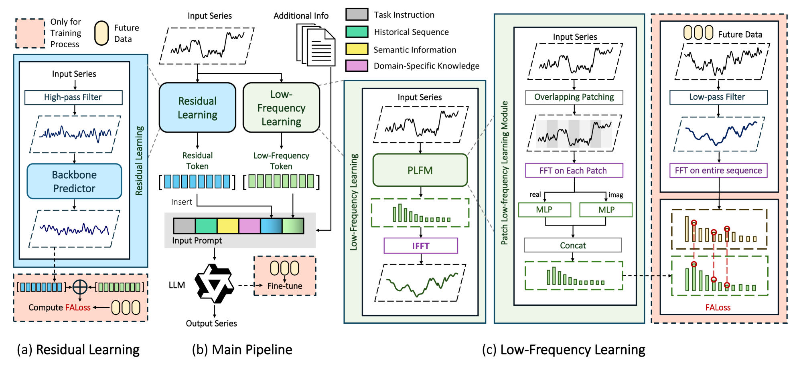

#+title:      数据少的时候，先把慢的部分学会
#+subtitle:   低频趋势交给频域、高频残差单独建模、语义交给大模型校准 — LoFT-LLM: Low-Frequency Time-Series Forecasting with Large Language Models
#+date:       [2026-08-05 三 21:52]
#+filetags:   :paper:
#+identifier: 20260805T215236
#+source:     arXiv:2512.20002v3（KDD 2026 camera-ready）
#+authors:    Jiacheng You, Jingcheng Yang, Yuhang Xie, Zhongxuan Wu, Xiucheng Li, Feng Li, Pengjie Wang, Jian Xu, Bo Zheng, Xinyang Chen
#+venue:      ACM SIGKDD 2026 (arXiv:2512.20002)

* 问题

一家基金公司要做次日申购赎回量的预测。历史数据只有不到两年日频记录，其中还夹着政策调整、市场情绪造成的剧烈跳动。模型的预测窗口里，噪声和真实的长期趋势混在一起——一个把注意力都放在"昨天暴跌"上的模型，可能根本看不见"整体在下行通道里"这个事实。训练数据少的时候，这个问题会被放大：模型更容易被少数尖峰带偏，而不是学到可迁移的慢趋势。

旧路是两类模型各自缺一半。纯时序深度模型把辅助信息（页面访问量、利率、云量）归一化成数值向量塞进输入，语义被抹平；LLM 时序模型能读文字，但让它从零预测高频噪声会把它带偏。论文的作者看到的口子是：把"学什么"分开——趋势交给频域（模型对低频的谱偏置让它学得快、用更少样本就能学到），高频残差单独建一个轻量模块去补，最后让大语言模型只做它擅长的事：读辅助信息，修正数值模块的系统偏差。

* 翻译

#+ATTR_ORG: :width 1200

回到那家基金公司。LoFT-LLM 的训练分三个阶段，每个阶段用一个"过滤器"把任务切开。

*第一步：只学慢趋势（PLFM）。*目标序列先过一个低通滤波器（LPF），把高频成分剪掉，剩下的低频信号再做傅里叶变换，变成频域监督信号。输入侧不是整段 FFT，而是短时傅里叶变换式的重叠 patch——保留时间局部结构。一个双 MLP 网络分别拟合频谱的实部和虚部，用 FALoss 对齐预测与真值的傅里叶系数（两者之差的 L1 均值）。这一步的要点：模型学的不是"预测整条曲线"，是"预测这条曲线的低频骨架"。

*第二步：补高频残差。*PLFM 的权重冻结后，输入再过高通滤波器（HPF），用一个轻量骨干（论文用 iTransformer）拟合高频变化。训练时，高频残差预测加到低频预测上，还是用同一个 FALoss 对齐。这样高频和低频是分开建模、分开监督的，主网络不会为了迁就尖峰而牺牲趋势。

*第三步：让大语言模型校准。*前两步的结果（低频 token、残差 token）连同辅助变量和领域知识，由 PromptBuilder 打包成一段自然语言 prompt，交给 Qwen3-8B。LLM 经 QLoRA 监督微调后，直接输出一个数值列表作为最终预测。论文把 LLM 的角色定位为语义校准器：它不从头预测，而是读着"页面 UV 上升、利率下降"这类信息，把数值模块给出的粗预测往正确方向掰一掰。prompt 模板由 ChatGPT-4o 辅助生成，训练方式是 prompt-to-sequence 对齐（历史 prompt 拼未来序列）。

推理时三段冻结、直接拼接。论文在消融里给了两组有意思的对比：金融数据集上去掉 LLM 退化更大，说明辅助信号的语义对金融任务更关键；光伏数据集上去掉频率模块退化更大，说明太阳能的强周期性更依赖低频建模。

* 核心概念

*频域对齐损失（FALoss）。*把预测和真值都做傅里叶变换，然后比较对应频率系数，取差的绝对值平均。时域 MSE 会把注意力放在对齐高频抖动上，频域损失则逼着模型先对低频。在基金例子上：模型的低频骨架对了，比它把某一天的尖峰猜准更有价值。少了它，第一步的 PLFM 就退化成普通 MLP 回归，噪声会淹没趋势。

*局部谱建模（STFT 式）。*不是整条序列做一次 FFT，而是切重叠 patch 后逐 patch 做 DFT。整段 FFT 会把时间上不同位置的模式混在一起；重叠 patch 保留"哪个时段发生什么"的局部信息。在基金例子上：政策冲击往往只持续几天，局部谱能捕捉这种短窗口的低频变化，全局谱会把它稀释。

*语义校准器（Semantic Calibrator）。*论文对 LLM 角色的定义。它出现在流程末端，输入是打包成文本的模型预测加辅助变量，输出是修正后的数值列表。在基金例子上：数值模块不知道"该基金近期页面访问激增"，LLM 从 prompt 里读到这条信息后，可以把预测往高调。这个定位和 Time-LLM 的"LLM 在前端做重编程推理"相反——论文让 LLM 做后端校准。

* 洞见

数据稀缺时的时序预测，与其让一个模型什么都学，不如把任务切开，各用各的优势：低频趋势靠频域（谱偏置使它样本效率高），高频残差靠轻量模块，语义靠语言模型。论文用"分工"代替"全能"。

* 博导审稿

选题眼光：问题真实。金融、能源这些高价值场景确实数据稀缺、辅助变量丰富，few-shot 是刚需。三阶段拆分也符合谱偏置这类已知原理，方向站得住。

方法成熟度：组合老件，拼装合理。FALoss 源自 FreDF，残差学习是常规做法，LLM 校准借了 prompt 范式。没有新的认知突破，但工程整合干净。最值得追问的预设是：LLM 校准的质量完全依赖 prompt 打包的信息是否完整、ChatGPT-4o 生成的模板是否对特定任务稳定——论文没有讨论 LLM 读错或漏读辅助信息时的退化路径。

实验诚意：有短板。只有两个数据集（一个 675 点、一个 8,760 点），样本量小；12 个基线覆盖广但 few-shot 下只和各自任务的最佳基线比平均降幅，没有与 FSTLLM 这类专门 few-shot 方法直接横向对比。消融做了一组（频率模块 × LLM 的二乘二），patch length 消融在附录。三次运行取平均并报标准差，这点诚实。

写作功力：方法图完整，prompt 示例清楚。但"为什么 LLM 校准在金融上更关键"只给了数据集层面的归因，缺少机制层面的分析。

判决：weak accept。问题真实、整合干净、few-shot 提升显著，但实验规模小、缺少专门 few-shot 方法对比，结论需要更多数据集复核。

* 启发

迁移：FALoss + 频域低频监督可以单独移植到任何多步预测骨干上（FreDF 已经证明频域损失通用），LoFT-LLM 的贡献在于把"频域监督"从训练技巧升级成完整流水线的一环。如果我维护的预测模型有高频噪声问题，可以先只加 FALoss 看低频是否改善，再决定是否引入 LLM 校准。

混搭：语义校准器的定位（后端修正而非前端推理）可以跟 [[time-llm|Time-LLM]] 的前端重编程、[[source-fstllm|FSTLLM]] 的 few-shot 设计放一起看——三条路线正好构成 LLM 介入时序预测的位置光谱。

反转：我默认认为 LLM 应该参与越多越好。这篇提醒的是：LLM 放对位置（后端校准）比放多位置更有效——数据稀缺时，让模型各司其职可能比堆一个全能模型更稳。
