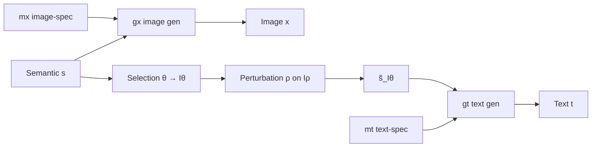

# Cross-Modal Misalignment

**Cross-modal misalignment**（跨模态错位）指配对多模态样本（典型：图像–文本）在**共享语义因子上并不一致**：文本省略图像中存在的语义，或改写/误标语义。Cai, Liu et al.（NeurIPS 2025, arXiv:2504.10143）在多模态对比学习（MMCL）下将其形式化为 **selection bias** 与 **perturbation bias**，并给出可辨识性与实践指南——**不是一律当噪声清洗，也不是一律当数据增强**[^src-cross-modal-misalignment]。

## 两派对立与统一

| 立场 | 典型动机 | 本文定位 |
|------|----------|----------|
| **Mitigate** | 幻觉、弱/错监督、对齐评测 | 当任务需要**全语义覆盖**（foundation 预训练）时必须缓解 |
| **Leverage** | 风格扰动、噪声稳健、prompt 微调 | 当任务需要**对环境漂移不变**的因子时，可把 bias 对准 \(I_{\mathrm{var}}\) |

统一机制：MMCL 只保留对 selection/perturbation **无偏**的共享语义子集；错位部分从表示中系统性剔除——对“要全信息”是损失，对“要不变性”是正则[^src-cross-modal-misalignment]。

## 潜变量形式化

- \(I_\theta\)：文本**选中**的语义索引；\(I_\theta^c\)：**省略**（selection）。  
- \(I_\rho \subsetneq I_\theta\)：其中可被随机扰动的子集；\(I_\rho^c = I_\theta \setminus I_\rho\)：**跨模态无偏保留**。  
- 图像侧 \(g_x\) 见完整 \(s\)；文本侧只见 \(\tilde s_{I_\theta}\)。模态特异 \(m_x, m_t\) 不跨模态共享[^src-cross-modal-misalignment]。

## 理论结论（可操作）

1. **Thm. 4.1**：最小化对齐–熵目标时，表示 **block-identify** \(s_{I_\rho^c}\)；\(s_{I_\theta^c}\)、\(s_{I_\rho}\)、\(m_x\)、\(m_t\) 均被排除（与 \(s\) 上任意因果图无关）。  
2. **全语义预训练（Cor. 4.1）**：需 \(\theta\) 覆盖 \(I_s\) 且 \(I_\rho=\emptyset\)；规模 alone **不能**恢复被省略/扰动的语义。  
3. **不变表示（Cor. 4.2）**：若 \(I_{\mathrm{var}} = I_\theta^c \cup I_\rho\)，则学到 \(s_{I_{\mathrm{inv}}}\)——文本侧**可审计的省略/改写**可替代难做的潜变量干预[^src-cross-modal-misalignment]。

## 何时缓解 vs 利用

| 目标 | 对 misalignment 的策略 | 设计动作 |
|------|------------------------|----------|
| 多下游 / 丰富语义 | **缓解** | 提高 caption 覆盖与事实一致；重写 alt-text；过滤错对 |
| OOD / 域泛化 | **利用** | 故意省略或扰动**漂移敏感**属性（风格、背景、非因果相关词） |
| 诊断已训 CLIP 类模型 | **度量** | 概念 coverage ≈ selection 代理；低覆盖组零样本弱（OpenCLIP 案例） |

OpenCLIP@LAION-400M：高覆盖组（Animal/Object/Color）零样本 F1 高；Trait/Emot./Texture 等低覆盖组显著差——与“省略语义进不了表示”一致[^src-cross-modal-misalignment]。

## 与本仓库多模态时序页的关系

| 页面 | 关系 |
|------|------|
| [[contrastive-learning]] | MMCL / InfoNCE 是本文分析对象；本文给出**错位下可辨识语义子集** |
| [[ts-vl-alignment]] | 诊断**已预训练空间**近正交与投影上限；本文解释**训练对生成过程**下为何只保留无偏共享语义 |
| [[constrained-text-fusion]] | 任务侧：无关/冲突文本无控注入伤预测 → 约束融合；本文预训练侧：冲突/省略语义**根本进不了**对比表示 |
| [[time-mmd]] / [[multimodal-time-series-forecasting]] | 外生文本若只覆盖部分动力学因子 = selection；错误新闻/展望 = perturbation → 对齐与融合设计应预期“只共享无偏子集” |

## 局限

偏图像–文本语义错位；web 语料上 \(\theta,\rho\) 的估计管线、时间错位、涌现跨模态语义、随机缺失与线性可辨识性仍开放[^src-cross-modal-misalignment]。

## 相关页面

- [[source-cross-modal-misalignment]] — 源摘要  
- [[contrastive-learning]] · [[ts-vl-alignment]] · [[constrained-text-fusion]] · [[multimodal-time-series-forecasting]] · [[time-mmd]]

[^src-cross-modal-misalignment]: [[source-cross-modal-misalignment]]
