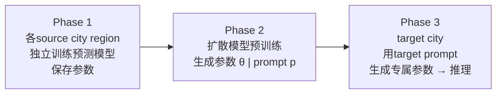

# GPD: Generative Pre-training via Diffusion for Spatio-Temporal Few-Shot Learning

**GPD**（Generative Pre-training framework based on **D**iffusion）是清华大学 FIB Lab（Yuan, Shao, Ding, Jin & Li）在 ICLR 2024 提出的时空少样本学习框架[^src-gpd]。其核心洞察：不在数据空间上做 transfer（如 [[regiontrans|RegionTrans]]、DASTNet），而是在**参数空间**上进行生成式预训练——用一个 Transformer-based 扩散模型作为 hypernetwork，从 source cities 的优化模型参数中学习生成能力，再为目标城市生成适配的预测模型参数[^src-gpd]。

## 核心设计

### 三阶段框架



| 阶段 | 输入 | 输出 |
|------|------|------|
| 准备 | 各 source city 的 region 数据 | 各 region 的优化模型参数集合 T(θ) |
| 预训练 | T(θ) + source prompts | 训练好的扩散模型 Gγ |
| 生成 | target prompt + 高斯噪声 | target 各 region 的专属参数 θ₀ |

### 扩散 hypernetwork（Phase 2）

与传统扩散预测（[[timegrad|TimeGrad]]、[[diffstg|DiffSTG]]）在数据空间加噪-去噪不同，GPD 的扩散过程发生在**参数空间**[^src-gpd]：

1. **参数 tokenization**：将异构层参数通过 GCD-based chunking 转成统一维度的 token 序列，保持层间邻接关系[^src-gpd]
2. **Transformer 去噪网络**：标准 Transformer encoder 在 noise-corrupted parameter tokens 上操作，预测注入的噪声 ε[^src-gpd]
3. **条件注入（conditioning）**：5 种策略探索，最优为 Pre-conditioning with inductive bias——spatial prompt 均匀加到空间相关参数，temporal prompt 加到时间相关参数[^src-gpd]

$$\mathcal{L} = \mathbb{E}_{\theta_0,\epsilon \sim \mathcal{N}(0,1),k}\left[\|\epsilon - \epsilon_\gamma(\theta_k, p, k)\|^2\right]$$

### Region Prompts

| Prompt 类型 | 来源 | 编码方法 |
|-------------|------|---------|
| **Spatial** | 城市场景知识图谱（UKG：BorderBy / NearBy / SimilarFunc） | TuckER KG embedding |
| **Temporal** | target city 极少时序数据（3 天） | MAE-style 自监督（75% mask ratio） |

### 预测模型兼容性

GPD 是 model-agnostic 的 hypernetwork，验证了三种 base model[^src-gpd]：

| Base Model | 类型 | 性能排序 |
|-----------|------|---------|
| GWN (Graph WaveNet) | Graph-based | 最优 |
| STGCN | Graph-based | 约等于 GWN |
| STID | MLP-based（无 graph） | 略低 |

## 关键性能

> 4 数据集平均较最优 baseline 降低 **7.87%** 误差[^src-gpd]。

| Target City | Type | MAE 降低% | 第6步MAE优势 vs STGFSL |
|-------------|------|-----------|----------------------|
| Washington D.C. | Crowd flow | -4.31% | -6.9% |
| Baltimore | Crowd flow | **-17.1%** | **-22.1%** |
| METR-LA | Traffic speed | -2.1% | -0.3% |
| Didi-Chengdu | Traffic speed | -8.17% | — |

**长期预测优势显著**：Baltimore 目标城市场景下，Step 1 仅 -5.9% → Step 6 **-22.1%**（vs STGFSL），表明 GPD 有效传输了长期时序知识[^src-gpd]。

**多 source city 收益**：使用 2 个 source cities 比 1 个在 Step 6 上显著提升（Washington +16.4%, Baltimore +14.2%, NYC +18.9%）[^src-gpd]。

## 与其他扩散+时空工作的关系

> [!important] GPD 是 hypernetwork，不是数据空间扩散预测

| 维度 | [[diffstg\|DiffSTG]] | [[specstg\|SpecSTG]] | **GPD** |
|------|-------------|-------------|---------|
| 扩散对象 | 时空序列 Xᴬᴸᴸ | 图傅里叶信号 | **模型参数 θ** |
| 角色 | 条件生成（预测） | 条件生成（预测） | **hypernetwork（生成网络）** |
| 输出 | 未来序列联合分布 | 谱域未来表示 | **完整预测模型** |
| 范式 | 直接预测 | 直接预测 | **生成预测器** |

GPD 与这些工作的关系是**互补**而非替代——GPD 生成的 base model 可以是任何 STG 预测模型，包括未来的扩散预测模型[^src-gpd]。

## 在演化链中的位置

在 Tsinghua FIB Lab 的研究脉络中，GPD 代表从传统 transfer learning 向 **参数化少样本生成** 的过渡[^src-gpd]：

```
传统跨城市迁移 → GPD (hypernetwork生成参数) → UniST (MAE预训练+零样本) → UniFlow (grid+graph统一) → UrbanDiT (多任务+rectified flow)
```

GPD 的"参数空间预训练"思想影响了后续 FIB Lab 的路线，但其 region-level 训练和 graph-only 限制在 [[unist|UniST]] 和 [[urbandit|UrbanDiT]] 中被逐步解除[^src-urbandit]。

## 局限性

- **graph-only**：仅支持 graph-structured 时空数据（路网传感器），不支持 grid 数据[^src-gpd]
- **region-level 预训练数据需求**：要求 source cities 有充足数据逐 region 训练模型[^src-gpd]
- **采样速度**：DDPM 500 步去噪，未实验 DDIM 加速[^src-gpd]
- **非完全零样本**：target city 仍需 3 天数据提取 temporal prompt[^src-gpd]

[^src-gpd]: [[source-gpd]]
[^src-urbandit]: [[source-urbandit]]
