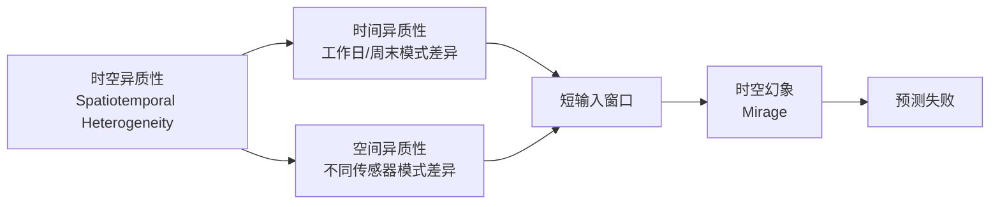

# Spatiotemporal Mirage

**Spatiotemporal Mirage**（时空幻象）是时空预测中的一种现象，指由于输入窗口长度受限导致模型无法区分以下两种情况[^src-2312-00516-std-mae]：

1. **不同输入 → 相似未来**：两个传感器在输入窗口内表现出截然不同的历史序列，但它们的未来值却非常相似
2. **相似输入 → 不同未来**：两个传感器在输入窗口内几乎相同，但它们的未来值差异显著

## 产生原因

时空幻象的根源在于**端到端模型的输入长度限制**[^src-2312-00516-std-mae]：

- 标准时空预测设置中，输入长度 $T = 12$（即 1 小时，每步 5 分钟）
- 模型高复杂度限制了输入窗口的扩展
- 在短窗口内，模型只能捕获**碎片化的异质性**而非**完整的异质性**
- 由于无法获取更长的上下文信息，模型将部分相似的短期模式误判为整体行为

## 与时空异质性的关系

时空幻象本质上是**异质性碎片化**的后果。当数据规模增大（数百传感器、数月数据），时空异质性高度混合，而短输入窗口只能捕捉到局部片段，导致幻象[^src-2312-00516-std-mae]。

## 解决策略

### 预训练增强（STD-MAE）

[[std-mae|STD-MAE]] 通过时空解耦掩码预训练解决此问题[^src-2312-00516-std-mae]：

1. **长期输入**：预训练使用 864 步（3 天）而非 12 步
2. **解耦学习**：分别沿空间和时间维度重建，学习清晰的空间和时间异质性
3. **即插即用**：预训练表征可直接增强任意下游预测器，使其"看穿"幻象

### 定性效果

在 PEMS 数据集的实际案例分析中（传感器 215 和 279）：
- GWNet（基线）不能区分两种幻象情况，预测误差显著
- STD-MAE 增强版本准确捕捉趋势转折，具备区分能力[^src-2312-00516-std-mae]

## 关联概念

- [[std-mae]] — 时空解耦掩码预训练框架，直接应对时空幻象
- [[traffic-forecasting]] — 交通预测综述
- [[heterogeneity-in-spatiotemporal-data]] — 时空数据异质性（待创建）

[^src-2312-00516-std-mae]: [[source-2312-00516-std-mae]]
