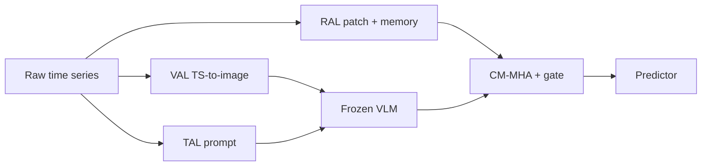

# Time-VLM

**Time-VLM** 是 ICML 2025 / arXiv:2502.04395 提出的**多模态时序预测框架**：用冻结预训练 **Vision-Language Model (VLM)** 统一 **时序 · 视觉 · 文本** 三模态，通过检索增强时序记忆 + 时序自生成图像/提示，在 few-shot / zero-shot 场景借 VLM 先验做预测增强[^src-time-vlm]。作者：Zhong / Ruan / Jin / Li / Wen / Liang（HKUST-GZ 等）。代码：`CityMind-Lab/ICML25-TimeVLM`[^src-time-vlm]。

## 问题设定

- **文本增强**（[[source-time-llm|Time-LLM]]、GPT4TS 等）：语义强，但连续时序→离散文本易损细粒度动态。  
- **视觉增强**（TimesNet、VisionTS、TimeMixer++ 等）：连续结构友好，缺领域语义。  
- **缺口**：同时桥接三模态、且能利用 VLM 预训练对齐空间的框架稀缺[^src-time-vlm]。

Time-VLM 的关键主张：不必引入外生新闻或卫星；从**原始时序内部**生成图像与文本，投到 VLM 的联合空间，再与检索时序特征融合——**自增强多模态**而非外生协变量适配[^src-time-vlm]。

## 架构：RAL + VAL + TAL + 冻结 VLM

### Retrieval-Augmented Learner（RAL）

1. Instance norm → **patchify**（默认 patch 16 / stride 8）→ 线性投影 + 位置编码得到 \(E_p\)。  
2. **Memory bank**（容量 \(M\)，环形更新）：当前 patch 时序平均后写入。  
3. **Local memory**：对当前 patch 与 bank 做余弦相似度 top-k 检索 → 两层 MLP → 与 \(P\) 残差。  
4. **Global memory**：对 \(P\) multi-head self-attention 后 patch 维平均。  
5. \(M_{\mathrm{fused}} = M_{\mathrm{local}} + M_{\mathrm{global}}\)，作为高阶时序表示 / 融合 query[^src-time-vlm]。

与 [[source-raf|RAF]] 的“检索历史 motif 拼到输入再喂 TSFM”不同：RAL 是**模块内层次记忆**（local 相似 patch + global 注意力），服务于后续跨模态注意力，而非黑盒零样本拼接[^src-time-vlm]。

### Vision-Augmented Learner（VAL）

1. **Frequency encoding**：FFT 频谱与原序列拼接。  
2. **Periodicity encoding**：\(\sin(2\pi t/P),\cos(2\pi t/P)\)（\(P\) 按数据集：ETTh 24、ETTm 96、Weather 144 等）。  
3. 多尺度 1D/2D 卷积 → 三通道图 → 双线性插值到 \(H\times W\)（默认 64）→ min-max 到 \([0,255]\)。  
4. 冻结 VLM **vision encoder** 提取视觉 token[^src-time-vlm]。

### Text-Augmented Learner（TAL）

动态构造结构化 prompt：任务（seq_len / pred_len）、域上下文、统计量（min/max/median/趋势/top-k lags）、图像描述；可叠专家预定义文本。冻结 VLM **text encoder** 出文本 token[^src-time-vlm]。

### 多模态融合与优化

- VLM 输出多模态嵌入 \(F_{\mathrm{mm}}\)（默认 token 长 156、隐维 768）。  
- \(F_{\mathrm{tem}}\)（RAL）与 \(F_{\mathrm{mm}}\) 投影到共享 \(d_{\mathrm{model}}\)；**CM-MHA**：\(Q\leftarrow F_{\mathrm{tem}}\)，\(K,V\leftarrow F_{\mathrm{mm}}\)；残差 + LayerNorm。  
- **Gate**：\(G=\sigma(W_g[F_{\mathrm{tem}};F_{\mathrm{mm}}]+b_g)\)，\(F_{\mathrm{fused}}=G\odot F_{\mathrm{attn}}+(1-G)\odot F_{\mathrm{mm}}\)。  
- 预测头全连接；损失 MSE；**冻结 VLM**，只训 RAL / VAL / 门控与头。默认 **ViLT**；CLIP、BLIP-2 可用[^src-time-vlm]。

## 实证摘要

| 设定 | 要点 |
|------|------|
| Few-shot 5% | ETTh1 MSE 0.442 vs Time-LLM 0.627（约 −29.5%）；Weather 相对 Time-LLM MSE −7.7%[^src-time-vlm] |
| Few-shot 10% | 多数 ETT/Weather 仍优或紧贴；ECL/Traffic 上 Time-LLM 等可更好[^src-time-vlm] |
| Zero-shot ETT 迁移 | 与 Time-LLM 互有胜负；如 ETTh1→ETTh2 MSE 0.338 vs 0.353[^src-time-vlm] |
| M4 短程 | 加权 SMAPE 11.894 / MASE 1.592 / OWA **0.855**，优于 Time-LLM 0.859 等[^src-time-vlm] |
| 全量长程 | ETT/Weather 竞争力强；ECL、Traffic 可落后专用单模态[^src-time-vlm] |
| 效率 | ~**143.6M** 参；Time-LLM ~3405M；大集上 Time-LLM 显存常不可行[^src-time-vlm] |

**消融（Weather）**：去 RAL **+35.6%** MSE（local +17.2%、global +4.3%）；去 VAL **+9.0%**；去 TAL **+2.1%**——时序检索记忆主导，视觉次之，文本因 VLM 文本 token 稀疏（如 ViLT 156 token 中约 11 为文本）贡献有限[^src-time-vlm]。**Custom ViT-B/16 + BERT-Base** 平均 MSE 0.348 弱于 ViLT 0.336，说明预训练**跨模态对齐**本身是归纳偏置[^src-time-vlm]。

## 在谱系中的位置

| 工作 | 关系 |
|------|------|
| [[source-time-llm|Time-LLM]] / GPT4TS | 文本/LLM 重编程路线；Time-VLM 用更轻 VLM + 视觉通道，少样本常更强、参数少一个数量级[^src-time-vlm] |
| [[source-raf|RAF]] / [[gtr|GTR]] | 同属检索增强，但 RAF 面向 TSFM 零样本 motif 拼接；Time-VLM 的 RAL 是 VLM 管线内 local/global 记忆[^src-time-vlm] |
| [[st-vision-llm|ST-Vision-LLM]] | 亦“时序当图像”，面向交通网格 + 生成式 Vision-LLM；Time-VLM 是通用 LTSF 基准 + 冻结 VLM 编码器融合[^src-time-vlm] |
| [[source-solar-vlm|Solar-VLM]] | 外生卫星图 + 天气文本 + 跨站点图；Time-VLM 强调**无外生**自增强，Solar-VLM 基线含 TimeVLM[^src-time-vlm] |
| [[time-mmd|Time-MMD]] / [[vot|VoT]] | 外生/事件文本与数值对齐；Time-VLM 不吃外生语料，VoT 报告中亦将 Time-VLM 列为多模态对照[^src-time-vlm] |
| [[ts-vl-alignment|TS–VL Alignment]] (Yashwante & Yu) | **对齐几何诊断**（非预测器）：独立预训练 TS/V/L 近正交；后验对比投影有限且不对称，图像可作中介；外生多模态不能默认 foundation 空间自然贴合——支撑 Time-VLM 依赖**显式 VLM 耦合 + 时序成图/成文**而非 PRH 自动收敛[^src-time-vlm][^src-ts-vl-alignment] |
| [[constrained-text-fusion|CFA]] | 外生文本 **naive vs constrained** 大规模对照：无控 add/concat 常低于 unimodal；低秩残差 plug-in。与 Time-VLM 的门控融合同属「控制文本影响」，但 CFA 锚定 Time-MMD 外生文本而非内生 VLM 图文[^src-constrained-text-fusion] |
| [[unica|UniCA]] / [[cora-tsfm|CoRA]] | TSFM **外生协变量适配**；Time-VLM 是 backbone+VLM 的端到端多模态预测器，非适配器框架[^src-time-vlm] |

## 局限

TAL 受通用 VLM 时序语义与短文本限制；全量高维集可落后专用模型；剧烈非平稳/突变上视觉变换仍不足；依赖自然图像–语言预训练分布，领域专用 VLM 仍是开放方向[^src-time-vlm]。

## 相关页面

- [[source-time-vlm]] — 源摘要  
- [[multimodal-time-series-forecasting]] · [[source-raf]] · [[retrieval-augmented-spatio-temporal-forecasting]]  
- [[source-solar-vlm]] · [[st-vision-llm]] · [[vision-language-traffic-forecasting]]  
- [[vot]] · [[time-mmd]] · [[source-time-llm]] · [[source-time-mmd]] · [[ts-vl-alignment]] · [[source-ts-vl-alignment]] · [[constrained-text-fusion]] · [[source-constrained-text-fusion]]

[^src-time-vlm]: [[source-time-vlm]]
[^src-ts-vl-alignment]: [[source-ts-vl-alignment]]
[^src-constrained-text-fusion]: [[source-constrained-text-fusion]]
