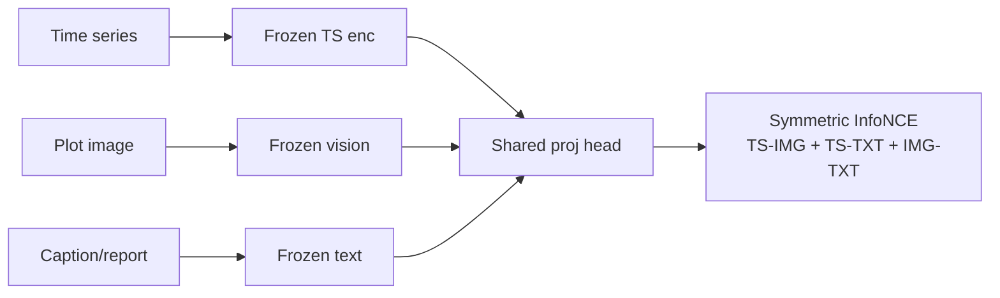

# TS–VL Alignment

**TS–VL Alignment** 指 Yashwante & Yu (arXiv:2602.19367, 2026) 对 **时序 · 视觉 · 语言** 在对比表示空间中对齐极限的系统实证。作者：Pratham Yashwante、Rose Yu（UCSD）。问题不是再提一个预测 backbone，而是：在 Platonic Representation Hypothesis 叙事下，**独立预训练三模态是否本就收敛？后验 CLIP 式投影能把时序“拉进”多模态共享空间多远？**[^src-ts-vl-alignment]

## 问题设定

- 图像显式空间几何；语言显式符号；时序语义（趋势 / 周期 / 异常）仅在数值动态中**隐式**出现。  
- 无显式耦合时，跨模态表示是否已共享几何？  
- 若用对称 InfoNCE 只训投影头、**冻结**编码器，对齐如何依赖尺度、caption 信息密度、视觉标注丰富度、文本直接/间接与语种？[^src-ts-vl-alignment]

## 框架

- 投影：Linear → LN → GELU → Dropout → Linear；三模态结构共享。  
- 损失：每对双向 InfoNCE，\(L_{\mathrm{total}}=L_{\mathrm{ts\text{-}img}}+L_{\mathrm{ts\text{-}txt}}+L_{\mathrm{img\text{-}txt}}\)。  
- 消融：双模态 TS–IMG / TS–TXT；**VL–TS**（冻结联合 VL + 时序编码器）。  
- 指标：cosine margin、R@k、Procrustes、CKA、mutual kNN；文本 **ID** = LM surprisal 总量[^src-ts-vl-alignment]。

**覆盖**：34 配置 / 26 编码器（时序含 Chronos、TimesFM、MOMENT、Moirai 等；视觉 DINOv2/v3、SigLIP、ViT、CLIP/BLIP-2；文本 Qwen、T5、E5 等）[^src-ts-vl-alignment]。

## 数据

| 集 | 用途 |
|----|------|
| [[source-ts-vl-alignment|CaTS-Bench]] | 主三元组；ID 梯度 / 高 ID 加倍 |
| TRUCE | 短直接描述 + 图变体（评测） |
| MIMIC-IV-ECG | 长波形 + 间接英文诊断 |
| PTB-XL | 间接德语报告（语言偏移） |

## 核心结果（可操作结论）

1. **Near-orthogonal without coupling**  
   独立预训练跨模态 MAD ≈ 90°（CaTS 示意 87.8°/89.5°/89.3°）。多模态 ST **不能默认**“各模态 foundation 已在同一 latent 世界”[^src-ts-vl-alignment]。

2. **Post-hoc contrastive projection is limited & asymmetric**  
   对齐随总参量升但**非均匀**：TS–IMG 强而早饱和；TS–TXT 弱、对尺度更敏感。全局几何可好，**kNN 局部重叠持续低**——适合“粗对齐”，难指望细粒度一一对应[^src-ts-vl-alignment]。

3. **Images as intermediaries**  
   三模态相对双模态 **抬升 TS–TXT**；对已强 TS–IMG 加文本常损。语义路径：隐式时序 → 显式折线 → 抽象文本，比直连 TS–TXT 更顺[^src-ts-vl-alignment]。

4. **Geometry / scaling / information dependence**  
   - 尺度：帮助弱对，不消除不对称。  
   - 文本 ID：低→中升，**加倍高 ID 近乎饱和**（Table 1 Δ≈0）。  
   - 间接临床文本、德语报告 → 对齐全面变差；更长 ECG 可强化 **TS–IMG 检索**（与文本质量解耦）。  
   - VL 预训练继承 IMG–TXT；annotated 图 > generic；大 batch / 强投影 / **更大时序编码器** 关键[^src-ts-vl-alignment]。

## 对外生多模态 ST 的含义

| 做法 | 本文视角 |
|------|----------|
| 冻 CLIP/VLM + 线性/轻量投影接时序 | 可行但有**几何上限**；TS–TXT 尤脆 |
| 只靠更长 caption / 更大模型 | ID 与尺度有收益区，之后**饱和** |
| 时序渲染为图再进 VLM | 与“图像中介”一致，格式匹配利于对齐[^src-ts-vl-alignment] |
| [[time-vlm|Time-VLM]] 自生成图文 + 冻 VLM | 应用层桥接；本文说明桥接**依赖显式耦合与显式性**，非 PRH 自动收敛 |
| [[time-mmd|Time-MMD]] / [[vot|VoT]] / [[timi|TiMi]] 外生文本 | 文本若仅高阶解读（诊断/新闻）而非结构描述，对齐信号更稀，需任务侧融合/引导设计 |
| 端到端联合预训练 / 任务耦合 | 协议未覆盖；作者标为未来方向，暗示**仅投影不够**时需更深耦合[^src-ts-vl-alignment] |

## 局限

单变量；合成 caption；临床域窄；冻编码器协议不评端到端；对齐指标与下游预测相关未系统建立[^src-ts-vl-alignment]。

## 相关页面

- [[source-ts-vl-alignment]] — 源摘要  
- [[multimodal-time-series-forecasting]] · [[contrastive-learning]] · [[time-vlm]] · [[source-time-vlm]]  
- [[chronos]] · [[timesfm]] · [[time-mmd]] · [[vot]] · [[st-vision-llm]]

[^src-ts-vl-alignment]: [[source-ts-vl-alignment]]
